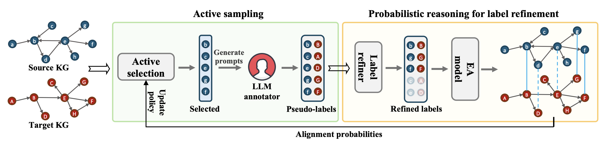

<h1 align="center">
Official Code of NeurIPS2024 paper
  
[Entity Alignment with Noisy Annotations from Large Language Models](https://openreview.net/forum?id=qfCQ54ZTX1)

---

   <p align="center"></p>
   <p align="center"><em>The framework of LLM4EA.</em></p>


## Table of Content

- [Environment setup](#Environment-setup)
- [Quick start](#Quick-start)
- [Ablations](#Ablations)
- [Simulations](#Simulations)
- [Customization](#Customization)
- [Bibtex](#Bibtex)
- [Acknowledgement](#acknowledgement)
- [License](#license)


### Environment setup

**Step1.** Install the required packages by running the following command:

```
pip install -r requirements.txt
```

**Step2.** Download the dataset from [here](https://anonymous.4open.science/r/processedOpenEAData-3674/) and put it in the `data` folder.

**Step3.** Specify the `gpt-api-key` in the `config.py` file with your openai API key.


### Quick start

**LLM4EA**: Run the following command to run llm4ea on D-W-15k dataset

```
python infer.py --dataset_name D-W-15K
```

**Baseline**: Run the following command to run dual-amn on D-W-15K dataset

```
python infer-baseline.py --dataset_name D-W-15K
```

> Note: to facilatate reproducibility, we provide the annotated pseudo-labels generated during experiments, this `quick start` by default load the saved pseudo-labels. To run the actual experiment, please specify the argment  `--load_chk False` in the command.

### Ablations

There are three optional scripts: `infer-baseline.py`, `infer-active-only.py`, and `infer-lr-only.py`, which are variants of the infer.py script.

- The `infer-baseline.py` script deactivates both the label refinement and active learning components of the framework, directly training the base EA model, Dual-AMN. This corresponds to the Dual-AMN baseline in the main table.
- The `infer-active-only.py` script deactivates the label refinement component of the model. This corresponds to the `w/o LR` ablation setting in the paper.
- The `infer-lr-only.py` script deactivates the active learning component of the model. This corresponds to the `w/o Act` ablation setting in the paper.


### Simulations

If you have no access to an OpenAI API, you can run the simulation by running the following command:

```
python infer.py --dataset_name D-Y-15K --simulate --tpr 0.5
```

here, the arguement `--tpr` specifies the true positive rate for the synthesized pseudo-labels.


### Customization

You may customize this framework to your dataset/task by revising the prompts. For instance, some dataset may not contain the entity names and rely on entity attributes to perform alignment, you may customize the `self.messages` and the `self.choose` function in `annotator.py->Annotator`.


### Bibtex

If you find this work helpful, please cite our paper:
```
@inproceedings{
chen2024entity,
title={Entity Alignment with Noisy Annotations from Large Language Models},
author={Shengyuan Chen and Qinggang Zhang and Junnan Dong and Wen Hua and Qing Li and Xiao Huang},
booktitle={The Thirty-eighth Annual Conference on Neural Information Processing Systems},
year={2024},
}
```


### Acknowledgement

The code is based on [PRASE](https://github.com/qizhyuan/PRASE-Python) and [Dual-AMN](https://github.com/MaoXinn/Dual-AMN), the dataset is from [OpenEA benchmark](https://github.com/nju-websoft/OpenEA), preprocessed by using the dump file `wikidatawiki-20160801-abstract.xml` from [wikdata](https://archive.org/download/wikidatawiki-20160801). The OpenEA dataset is licensed under the GPLv3 License.

### License

This project is licensed under the GNU General Public License v3.0 - see the [LICENSE](LICENSE.txt) file for details.
